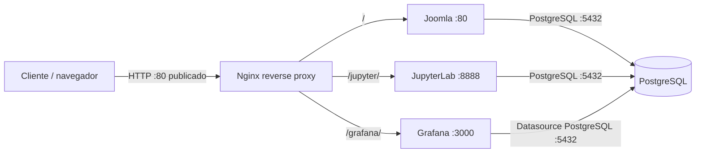

# Parcial 2 - Comunicaciones

Despliegue de una infraestructura web con Docker Compose. Integra Joomla, PostgreSQL, JupyterLab y Grafana detrás de un proxy inverso Nginx. Nginx es el único contenedor que publica un puerto en el equipo anfitrión.

## Requisitos

- Docker Desktop con Docker Compose v2.
- Puerto TCP 80 disponible.
- Conexión a Internet durante el primer inicio para descargar imágenes y dependencias.

## Estructura del proyecto

```text
.
├── docker-compose.yml
├── .env.example
├── INFORME.md
├── nginx/
│   └── default.conf
├── jupyter/
│   └── notebooks/
│       └── analisis_datos.ipynb
└── grafana/
    └── provisioning/
        ├── datasources/
        └── dashboards/
```

## Iniciar el entorno

Clona el repositorio y entra en su carpeta:

```powershell
git clone https://github.com/robinsonacc01/PARCIAL_2_COMUNICACIONES.git
cd PARCIAL_2_COMUNICACIONES
```

Crea el archivo local de variables de entorno y levanta los servicios:

```powershell
Copy-Item .env.example .env
docker compose up -d
```

La instalación de dependencias de Jupyter y la descarga de imágenes pueden tardar durante el primer inicio. Revisa el estado de los servicios con:

```powershell
docker compose ps
```

Jupyter y PostgreSQL deben llegar al estado `healthy`. Si Jupyter aparece como `starting`, espera un momento y vuelve a consultar.

## Servicios y rutas

| Servicio | URL | Función |
|---|---|---|
| Joomla (portal) | [http://localhost/](http://localhost/) | Portal institucional y CMS. |
| Jupyter | [http://localhost/jupyter](http://localhost/jupyter) | Entorno de notebooks con `analisis_datos.ipynb`. |
| Grafana | [http://localhost/grafana](http://localhost/grafana) | Dashboard aprovisionado con datos de PostgreSQL. |

Las credenciales se configuran en el archivo local `.env`. Joomla y Grafana usan las variables `JOOMLA_ADMIN_USERNAME`, `JOOMLA_ADMIN_PASSWORD`, `GRAFANA_ADMIN_USER` y `GRAFANA_ADMIN_PASSWORD`. Jupyter utiliza `JUPYTER_TOKEN`. No publiques `.env` con credenciales reales; comparte la plantilla `.env.example` y cambia las claves antes de exponer el entorno fuera de un equipo local de pruebas.

## Arquitectura de red



- `frontend_net` conecta Nginx, Joomla, Jupyter y Grafana.
- `backend_net` conecta Joomla, Jupyter, Grafana y PostgreSQL.
- PostgreSQL solo pertenece a `backend_net`; el puerto 5432 no se publica al host.
- PostgreSQL, Joomla y Grafana conservan sus datos en volúmenes Docker nombrados.
- Docker DNS permite que los servicios se comuniquen mediante nombres como `database` y `joomla`.
- Nginx conserva las cabeceras `Host`, `X-Real-IP`, `X-Forwarded-For` y `X-Forwarded-Proto`. Para Jupyter también habilita HTTP Upgrade y WebSockets, necesarios para la conexión del kernel.

## Datos y monitoreo

Grafana carga automáticamente su fuente de datos PostgreSQL y el dashboard definido en `grafana/provisioning`. El dashboard consulta tablas de Joomla en PostgreSQL y muestra estadísticas de usuarios y sesiones. No es necesario crear manualmente la fuente de datos ni importar el dashboard.

El cuaderno `jupyter/notebooks/analisis_datos.ipynb` utiliza `psycopg2` para conectarse a PostgreSQL y consultar las tablas. Las credenciales deben coincidir con las variables `POSTGRES_*` del archivo `.env`.

## Verificación

1. Ejecuta `docker compose ps` y comprueba que los cinco servicios estén activos. PostgreSQL y Jupyter deben aparecer como `healthy` una vez termine el inicio.
2. Abre [http://localhost/](http://localhost/) para comprobar Joomla.
3. Abre [http://localhost/grafana](http://localhost/grafana) y revisa el dashboard y sus paneles de usuarios y sesiones.
4. Abre [http://localhost/jupyter](http://localhost/jupyter), ejecuta las celdas de `analisis_datos.ipynb` y confirma que se conecte a PostgreSQL y liste las tablas.

Para consultar los registros de un servicio:

```powershell
docker compose logs --tail 100 jupyter
docker compose logs --tail 100 nginx
```

## Detener el entorno

Desde la carpeta del proyecto, ejecuta:

```powershell
docker compose down
```

Esto detiene y elimina los contenedores y redes del proyecto, pero conserva los volúmenes con datos. No uses `docker compose down -v` salvo que quieras borrar también los datos persistentes.

## Informe técnico

El análisis detallado de la topología, el flujo de información y las capas OSI se encuentra en [INFORME.md](INFORME.md).